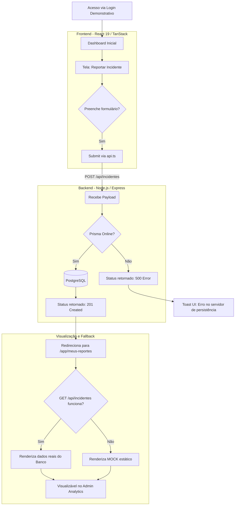

# Fluxo Operacional e Jornadas do ELIOT C2R SHIELD

Este documento visualiza as jornadas dos atores e o fluxo de dados técnico por trás das camadas do sistema, servindo como mapa de entendimento para avaliadores e auditores.

---

## 🧭 Jornadas de Usuário

### 1. Jornada do Usuário Comum (Institucional)
O usuário loga no sistema de forma transparente. Ao acessar o **Dashboard**, ele toma conhecimento de suas métricas (Insígnias/Nível). 
Caso perceba um e-mail falso, clica em **Reportar**, anexa um link suspeito e descreve o evento. Após enviar, a plataforma agradece e direciona para a tela **Meus Reportes**, onde o usuário acompanha que seu relato está *"Em análise"*. Mais tarde, o usuário pode acessar a área de **Capacitação** para assistir a um novo módulo de segurança.

### 2. Jornada do Administrador (TI/Segurança)
Acessa o sistema através de permissões elevadas. Na tela de **Gestão Operacional (Analytics)**, visualiza uma lista densa de todos os reportes da instituição ordenados por data. Pode buscar por relator ou filtrar apenas ocorrências com severidade *"Crítica"*. Clica num incidente de *"Malware"*, lê a descrição provida pelo usuário, inspeciona a URL no sandbox (contexto externo) e, dentro do painel, clica em **Validar Incidente**. A UI registra que o incidente foi contido e envia pontos de gamificação para o relator.

### 3. Jornada do Avaliador SBSeg
Inicia subindo o container Postgres. Executa as builds e scripts `seed`. Acessa `localhost:5173`. O sistema exibe o Login preenchido com e-mail/senha. O avaliador acessa com um clique. Ele então simula um reporte de phishing. Navega para as telas de *Dashboard* e *Analytics* para validar que a tabela de incidentes no backend PostgreSQL realmente armazenou a requisição REST e devolveu os dados.

---

## 📊 Fluxograma de Arquitetura e Decisão (Mermaid)

O diagrama abaixo ilustra o fluxo primário de Reportar um Incidente, até sua visualização no Analytics, englobando a estratégia de resiliência e fallback visual (quando a API ou o Banco caem durante uma demonstração avaliativa):

### Explicação do Fluxo de Resiliência (Fallback)
Para preservar a experiência de validação UX, as telas de listagem (`app.admin.analytics` e `app.meus-reportes`) utilizam um mecanismo de captura de promessas. 
Se `api.getIncidentes()` retornar um array válido, o estado da aplicação é hidratado com os dados reais do banco PostgreSQL. 
Se a rede estiver fora ou o backend offline, a Promise rejeita e o bloco `catch` emite um `console.warn` silencioso, mantendo na tela o array de objetos mock (`mock.ts`) instanciado no `useState` inicial. Isso previne telas brancas ("White Screen of Death") caso o avaliador teste o layout sem subir o Docker, garantindo o Selo D (Disponível para avaliação visual).

---
*Gerado por Auditoria Funcional ELIOT - Documentação Preparatória para SBSeg 2026*
